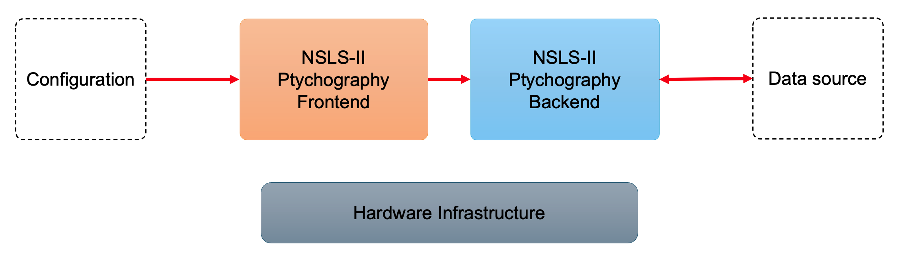
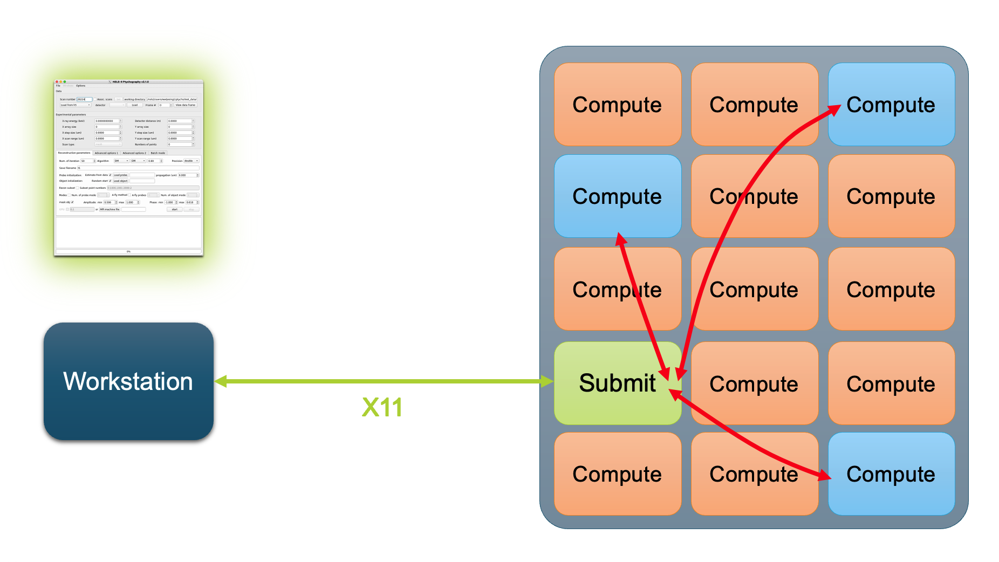

# NSLS-II Ptychography on Cluster

This project aims to provide cluster-based compute for existing ptychography workflows at NSLS-II.

## Roadmap

- CLI-based SLURM support (in testing)
- Integrate SLURM configurations to the ptychography GUI (planned)
- RESTful API based SLURM support (planned)

## Quick Start

The test deployment at HXN can be accessed using `run-ptycho-slurm` commandline tool. To run Ptychography GUI as a specific user `USER`:

```sh
/nsls2/data2/hxn/legacy/Hiran/ptycho_test/ptycho_gui/run-ptycho-slurm -u USER
```

This will authenticate using `ssh` first (if needed) and launch the Ptychography GUI targeting `pluto.nsls2.bnl.gov` cluster by default. You can change the defaults such as the `ssh` target and the proxy using options `--target TARGET` and `--proxy PROXY` (see Additional Options for more details).

### Additional Options

By default, `run-ptycho-slurm` will first attempt to jump via `ssh.nsls2.bnl.gov`, and if not successful, attempt to connect directly to `pluto.nsls2.bnl.gov` and start ptycho GUI on the submit node.

| Option | Description |
| -------- | ------- |
| `--help`, `-h`  | Print helpline message and exit.|
| `--no-jump`, `-n` | Do not attempt ssh proxy jump. |
| `--proxy PROXY`, `-p PROXY`    | Set ssh proxy (defaults to `ssh.nsls2.bnl.gov`). This is useful for running ptychography workflows from outside the science network. |
| `--proxy PROXY`, `-p PROXY`    | Set ssh proxy (defaults to `ssh.nsls2.bnl.gov`). This is useful, for instance, for running ptychography workflows on pluto from outside the science network. |
| `--target TARGET`, `-t TARGET` | Login node of the slurm cluster to target. Defaults to `pluto.nsls2.bnl.gov`. |
| `--user USER`, `-u USER` | Specify username (defaults to `$USER` environment variable) |
| `--verbose`, `-v` | Increase verbosity. |

## Technical Details

### Architecture

Existing NSLS-II Ptychography workflows run on workstations with direct coupling between the frontend and the backend, where they coexist on one workstation with CPU, GPU and memory resources (see figure below).



The frontend is a `PyQT` application that creates a `PtychoReconWorker` object that forks parallel worker processes using the `MPI` protocol. This project implements an alternative worker `PtychoReconSlurmLocalWorker` that instead uses SLURM CLI interface to execute `MPI` based worker processes on a SLURM cluster (see figure below). The frontend is executed on the `submit` node of the SLURM cluster using the `run-ptycho-slurm` command line tool described above, which sets up a `ssh` connection with `X11` forwarding.



### Live Previews

To provide live previews as the reconstruction job executes on the remote SLURM cluster, we extend the communication API between the frontend and backend by a new message type `[RESULT]` with the following signature:
```
[RESULT] {it} {label} {encapsulation} {data}
```
Here `{it}` and `{label}` stand for the iteration step and an identifier like `prb` or `obj` for "probe" and "object", and `{encapsulation}` and `{data}` signify the type of encapsulation (e.g.: `b64` for base64-encoded octet stream), and the actual data that contains a partially converged result in this particular application. This result is re-interpreted at the frontend as the live previews.